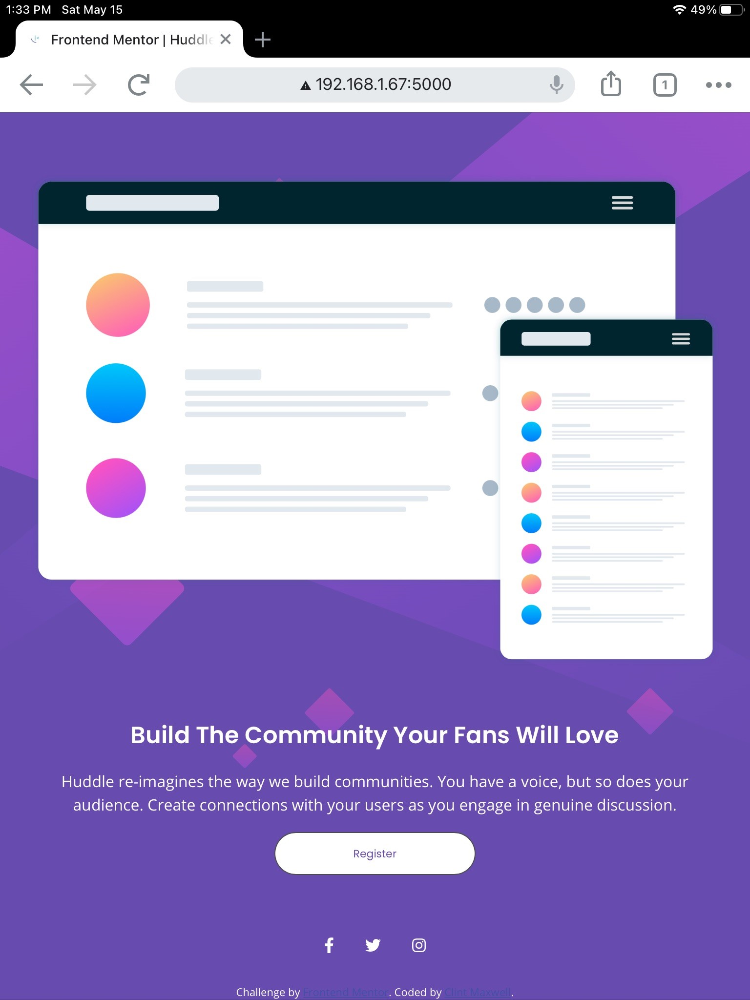

# Frontend Mentor - Huddle landing page with single introductory section solution

This is a solution to the [Huddle landing page with single introductory section challenge on Frontend Mentor](https://www.frontendmentor.io/challenges/huddle-landing-page-with-a-single-introductory-section-B_2Wvxgi0). Frontend Mentor challenges help you improve your coding skills by building realistic projects. 

## Table of contents

- [Overview](#overview)
  - [The challenge](#the-challenge)
  - [Screenshot](#screenshot)
  - [Links](#links)
- [My process](#my-process)
  - [Built with](#built-with)
  - [What I learned](#what-i-learned)
  - [Continued development](#continued-development)
  - [Useful resources](#useful-resources)
- [Author](#author)
- [Acknowledgments](#acknowledgments)


## Overview

### The challenge

Users should be able to:

- View the optimal layout for the page depending on their device's screen size
- See hover states for all interactive elements on the page

### Screenshots
#### Desktop Version


#### Tablet Version

#### Mobile Version


### Links

- Solution URL: [Huddle Page with Single Introductory Section Solution](https://www.frontendmentor.io/solutions/mobile-first-site-using-css-flexbox-R1qwJCpBE)
- Live Site URL: [Huddle Page with Single Introductory Section](https://antoniohoutx.github.io/huddle-landing-page-with-single-introductory-section-master/index.html)

## My process

### Built with

- Semantic HTML5 markup
- CSS custom properties
- Flexbox
- Mobile-first workflow
- [Font Awesome](https://fontawesome.com/) - Icon Library
### What I learned

While I was working on this project, the greatest insight I gained was code simplification.  Sometimes coding is not about re-inventing the wheel.  In the past, I admittedly have tended to overuse CSS Grid when a simpler layout could have accomplished the same goals with less code.  And less code is the bedrock in becoming a clean coder.  For example, in lieu of CSS Grid I used Flexbox for the desktop media query, as demonstrated in the following code snippet:

```css
main {
    display: flex;
  }
```

Not an elaborate or extraordinary approach, I admit.  But far simpler than setting up a messy grid that would have required code tweaking ad infinitum.

### Useful resources

- [CSS background-size property](https://www.w3schools.com/cssref/css3_pr_background-size.asp) - This helped me in getting the background image position just right for the mobile & tablet versions of the site.

## Author

- LinkedIn - [Clint Maxwell](https://www.linkedin.com/in/maxwellclint/)
- Twitter - [@clintmaxwell](https://www.twitter.com/clintmaxwell)
- Frontend Mentor - [@AntonioHouTX](https://www.frontendmentor.io/profile/AntonioHouTX)

## Acknowledgments

Once again, many thanks to [Drull](https://github.com/drull1000) for his youthful inspiration and ideas contributing to this project.
